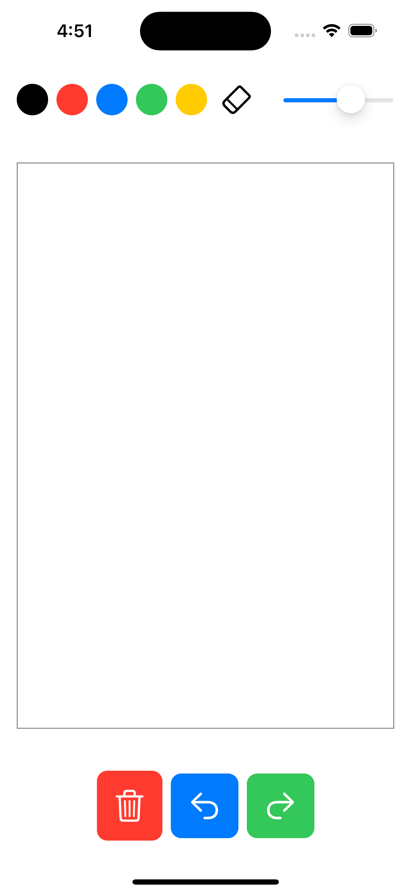
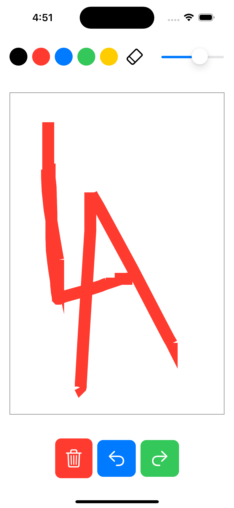
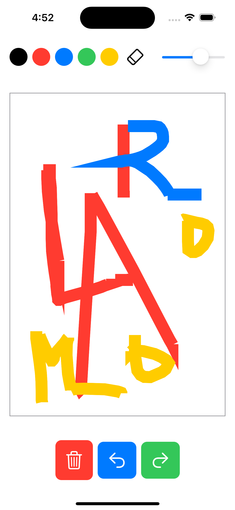
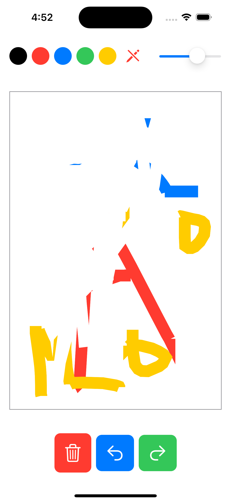

# Simple Drawing App

A basic drawing app built with SwiftUI that lets you draw, erase, change colors, adjust brush size, and manage undo/redo actions.

## Features

- **Brush Color Selector**: Choose from black, red, blue, green, and yellow.
- **Eraser Tool**: Toggle between drawing and erasing by switching to white.
- **Brush Size Control**: Adjust brush thickness with a slider.
- **Undo and Redo**: Correct mistakes by undoing or redoing your strokes.
- **Clear Canvas**: Clear the entire canvas with one button click.

## Screenshots

## Getting Started

To run the app:

1. Clone the repository or copy the code.
2. Open the project in Xcode.
3. Run the project on the iOS Simulator or a physical device.

### Prerequisites

- Xcode 12 or later
- iOS 14.0 or later

## Code Overview

### Key Components

- **`ContentView`**: The main view containing:
  - Color selection buttons
  - Eraser and brush size controls
  - Canvas for drawing with drag gestures
  - Undo, redo, and clear buttons
  
- **`DrawingPath`**: A struct representing a drawn path, including its color and points.

### Important State Variables

- `paths`: Stores completed drawing paths.
- `undonePaths`: Holds paths removed by the undo action, allowing redo functionality.
- `currentColor`: Tracks the selected brush or eraser color.
- `brushSize`: Manages the brush size for drawing or erasing.
- `isEraserActive`: Indicates if the eraser tool is currently active.

## Usage

1. **Select a Color**: Tap a color button to start drawing with that color.
2. **Adjust Brush Size**: Use the slider to change brush size.
3. **Draw on the Canvas**: Tap and drag on the canvas to start drawing.
4. **Erase**: Toggle the eraser with the eraser button; it changes to white for erasing.
5. **Undo/Redo**: Use the buttons to undo or redo actions.
6. **Clear Canvas**: Tap the trash icon to clear all drawings.

## License

This project is open-source and free to use for any purpose.

## Author

[Your Name]

Feel free to contribute or open issues to suggest improvements!

